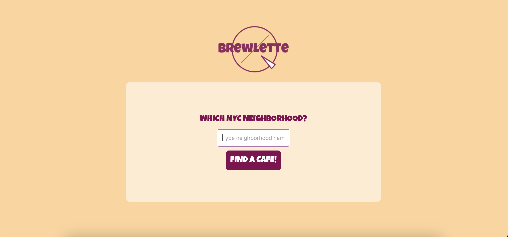
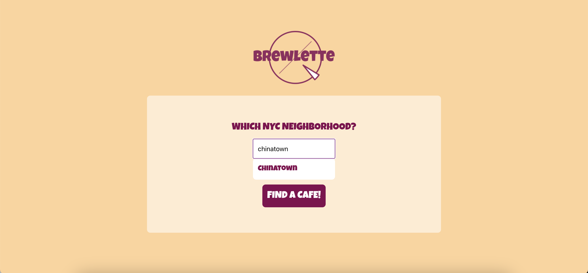
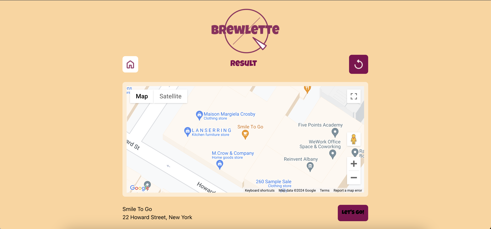

## Brewlette

Brewlette was born from a discussion amongst friends of the decision paralysis that comes from finding / choosing a cafe to work from in New York City. The app currently allows you to select a neighborhood, and a random cafe in that neighborhood will be chosen for you.

## Design

Brewlette was created in collaboration with amysit94@gmail.com, who designed and branded the app.

Design files found here:

- [Mockups](https://www.figma.com/file/8aOhK7mzboTZQ2sZXDr631/Brewlette?type=design&node-id=24-936&mode=design)
- [High-fidelity prototype](https://www.figma.com/proto/8aOhK7mzboTZQ2sZXDr631/Brewlette?page-id=24%3A936&type=design&node-id=24-937&viewport=400%2C454%2C0.08&t=11YPthM2cynHAELn-1&scaling=min-zoom&mode=design)

## Features / User flow

- User can select a NYC neighborhood from a dropdown
- A cafe from that neighborhood will be randomly selected and displayed
- Refresh to find new random cafe
- Return to home page to start new search

### User flow

## Stack Used

- React.js
- Node.js
- Express.js
- Tailwind

## Contact

jennytakahara@gmail.com
